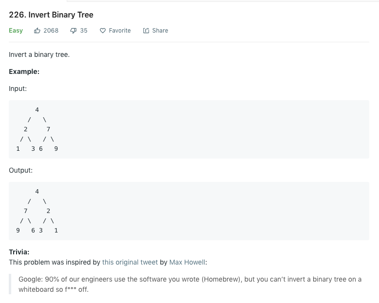

https://leetcode.com/problems/invert-binary-tree/submissions/





---
Runtime: 8 ms, faster than 58.51% of Swift online submissions for Invert Binary Tree.
Memory Usage: 21 MB, less than 100.00% of Swift online submissions for Invert Binary Tree.


---
``` Swift
class Solution {
    func invertTree(_ root: TreeNode?) -> TreeNode? {
        //print("val = \(root!.val)")
        // print("left = \(root!.left!.val)")
        // print("right = \(root!.right!.val)")
        
        guard root != nil else{
            return root
        }
        
        
        var tempNode:TreeNode! = root!.left
        
        root!.left  = root!.right
        root!.right = tempNode
        
        if root!.left != nil {
            invertTree(root!.left)
        }
        if root!.right != nil {
            invertTree(root!.right)
        }
        return root
    }
}
``` 